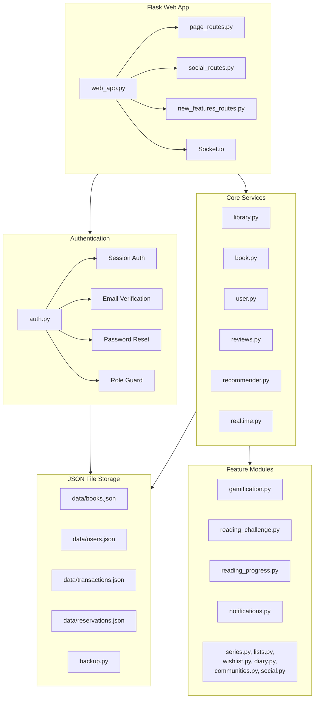

# Book-Tale — Architecture

## Key Patterns

- **JSON file storage**: No database — all data persisted as JSON files in `data/` directory
- **Backup system**: `backup.py` creates automatic `.bak` copies before write operations
- **Three-tier roles**: member → librarian → admin with progressive permissions
- **Email notifications**: Token-based email verification and password reset (1-hour expiry)
- **Rate limiting**: Login attempt tracking to prevent brute-force attacks
